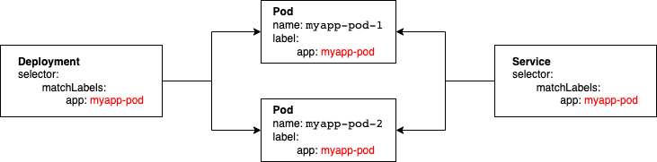
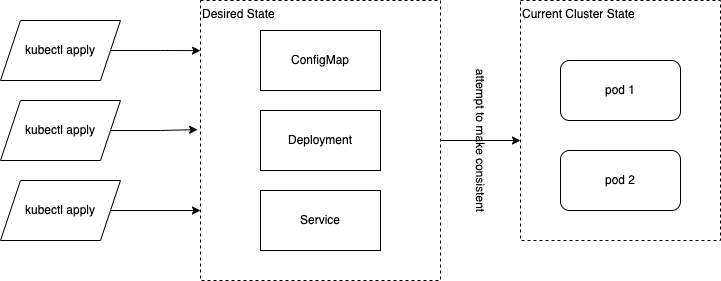

# Deploy application to Kubernetes #

## Introduction

In `myapp/src/myapp/main.py` there is a simple application with API we would
like to deploy within our Kubernettes cluster.

This app has been already published as Docker image
to https://hub.docker.com/r/grzegorzskorupa/myapp.

## Deplyments and Services

In order to provide our application as externally reachable we need at least 2
components: a Deployment (can also be simple pod) and a Service.

Deployment manages a group of pods.

```shell
kubectl apply -f 02-service/deployment/01-deployment.yaml
```

Service provides entrypoint to a group of pods. As long as service exists its IP
address does not change.

```shell
kubectl apply -f 02-service/deployment/service.yaml
```

There are various service types:

- ClusterIP - internal to cluster, good for local development
- LoadBalancer - when you are using common cloud providers
- Ingress - dedicated proxy with routing rules between external clients and
  internal Services

More on service types:

- https://platform9.com/blog/understanding-kubernetes-loadbalancer-vs-nodeport-vs-ingress/
- https://kubernetes.io/docs/concepts/services-networking/service/

Even though we have a service it is still not accessible from outside. We need
to forward the service port outside:

```shell
kubectl port-forward svc/myapp-service 8080:80
```

Now try going to http://localhost:8080



## Logs

```shell
kubectl logs <POD-NAME>
```

## Networking

In ubuntu pod:

```shell
cat /etc/resolv.conf
```

Try:

```shell
curl <POD-IP>
curl <POD-IP-DASHED>.<NAMESPACE>.pod
```

```shell
curl <SERVICE-CLUSTER-IP>
curl myapp-service
curl myapp-service.<NAMESPACE>
curl myapp-service.<MAMESPACE>.svc.cluster.local
```

## Is My Application Alive?

Kubernetes can check if our application is ready to serve traffic.

```shell
kubectl apply -f 02-service/deployment/02-deployment-probes.yaml
```

Check if it has deployed as expected. **What is the issue?**

**Liveness probe:** Application is working, kubernetes should NOT attempt to
restart it.

**Readiness probe:** Application is ready to serve traffic.

Application may be alive but not ready for example when the database it relies
on is not reachable.

### Exercise

Try breaking liveness probe or readiness probe and observe what happens.

## Replicas and Resources

You can ask kubernetes to create many pod instances for you.

You can and should define resources your service needs.

```shell
kubectl apply -f 02-service/deployment/03-deployment-replicas-resources.yaml
```

Notice that Deployment also creates ReplicaSet:

```shell
kubectl get replicaset
```

### Exercise

1. Delete one pod from deployment. What happens?
2. Try increasing replicas or resources. What happens when you ask for more than
   is available?

## Configuration:

You may want to pass some configurations to your service

```shell
kubectl apply -f 02-service/deployment/04-deployment-env-vars.yaml
```

Now try going to http://localhost:8080/config

## Kubernetes Philosophy

Kubernetes does not simply do what you order it to.

When you use kubectl to change what is within cluster (i.e. apply/create/delete)
you are asking it to attempt to reach a state consistent with what you asked
for.

This is a subtle yet important difference between:

'Can you please do this' vs 'Can you please attempt to reach the following
state'

Kubernetes will do all in its power to transform cluster to a consistent state
but it does not guarantee this state can be reached.



Kubernetes tries to be fault tolerant as much as possible and recover as soon as
possible. For example, it will keep trying to pull container image even though
one is not there. For example Service shall keep searching for pods that match
selector even though none will ever match it.

Kubernetes tries to impose as small constraints on order of operations as
possible. But do not expect you can do anything in any order. For example, you
can not create a pod that needs a configmap that is not present. Also don't
expect your pods to automatically restart when you change a config map.

.

.

.

.

.

.

.

.

.

.

.

## Appendix

Missing command for configuration:

```shell
kubectl create -f 02-service/deployment/config.yaml
```

You can also use kubectl to directly create secrets

```shell
kubectl create secret generic myapp-secrets \
  --from-literal=var_from_secret=do_not_tell
```
