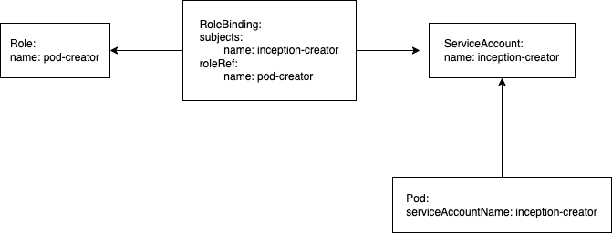

# RBAC

Role-based access control (RBAC) is a method of regulating access to computer or
network resources based on the roles of individual users.

## Pod Inception - 1st Attempt

Create a namespace called 'rbac', we will use this namespace for RBAC section:

```shell
kubectl create ns rbac
```

Can pods create other pods?

```shell
kubectl apply -f 06-rbac/kubectl_pod.yaml -n rbac
```

Check if it has run correctly. What is wrong?

## RBAC

Within a namespace:

- Role - defines what is allowed
- ServiceAccount - defines identity
- RoleBinding - connects ServiceAccount to Role (gives permissions)

Pod definition needs to point to service account to use.



## Role

Role `pod-creator` defines permissions to create pods

```shell
kubectl apply -f 06-rbac/role.yaml -n rbac
```

## Service Account

Defines identity `inception-creator`

```shell
kubectl apply -f 06-rbac/sa.yaml -n rbac
```

## Role Binding

Connects ServiceAccount `inception-creator` to Role `pod-creator`

```shell
kubectl apply -f 06-rbac/role_binding.yaml -n rbac
```

## Pod Inception - 2nd Try

Pod definition references service account `inception`:

```shell
kubectl apply -f 06-rbac/kubectl_pod_with_sa.yaml -n rbac
```

## Note on Cluster Level Permissions

Role and RoleBinding are limited to namespace they operate in.

One can also define permissions at cluster level. Cluster level equivalents of
Role and RoleBinding are: ClusterRole and ClusterRoleBinding respectively.

Some operations are possible only at cluster level. For example being able to
list nodes (`kubectl get nodes`) requires cluster level permissions.

## Further Reading

https://kubernetes.io/docs/reference/access-authn-authz/rbac/


